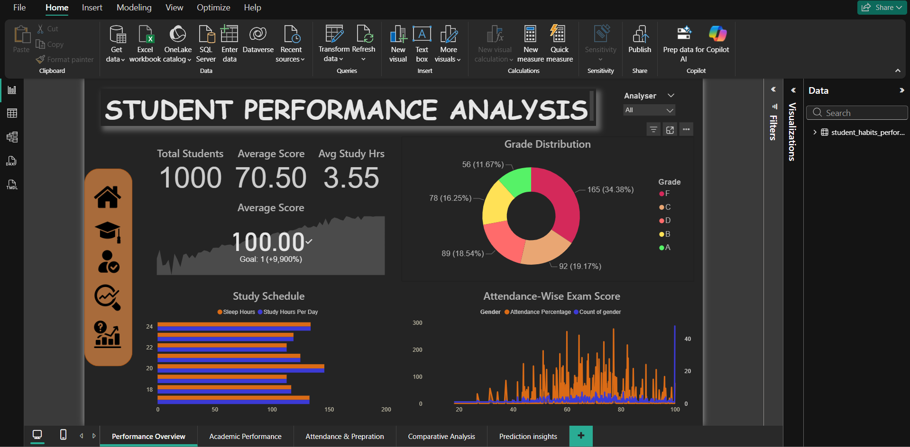

# 📊 Student Performance Analysis

This project explores how student lifestyle habits and external factors influence academic performance. Using data analysis and visualization techniques, we uncover patterns and relationships between features like study time, attendance, sleep, mental health, diet, and more.

---

## 📁 Project Structure

student-performance-analysis/
│
├── data/

│ └── student_habits_performance.csv

│
├── notebooks/

│ └── analysis.ipynb

│

├── README.md
└── requirements.txt

---

## 🎯 Project Objectives

- Understand how lifestyle habits affect student exam scores.
- Engineer new features like academic grades from numerical scores.
- Identify correlations between attendance, study time, and performance.
- Analyze mental health patterns and lifestyle impact.
- Visualize data effectively to derive actionable insights.

---

## 📌 Key Features Analyzed

- **Exam Score & Grades**
- **Study Hours**
- **Attendance Percentage**
- **Sleep Hours**
- **Mental Health Rating**
- **Diet Quality**
- **Exercise Frequency**
- **Social Media & Netflix Usage**
- **Parental Education Level**
- **Internet Quality**
- **Part-Time Job Status**

---

## 📈 Visualizations Used

- Correlation Heatmaps
- Bar Charts (e.g., Grade Counts, Parental Influence)
- Pie Charts (Grade Distribution)
- Box Plots (Mental Health across Study Hours)
- Violin & Strip Plots (Sleep vs. Exam Score)
- Line & Area Charts
- Scatter Plots with Trendlines

---

## 🔍 Insights Extracted

- Students with higher attendance and study time generally scored better.
- Poor sleep and diet correlated with lower mental health ratings.
- High social media and Netflix usage showed inverse relation with performance.
- Parental education level impacts study behavior and support levels.

---

## 🛠️ Tools & Technologies

- **Python**
- **Pandas**, **NumPy**
- **Matplotlib**, **Seaborn**, **Plotly**
- **Jupyter Notebook**

---

# Power BI Dashboard

